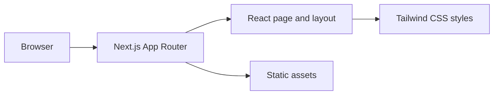

# Vibe Coding Starter


A minimal Next.js workspace for rapid, AI-assisted experiments. The repository is intentionally close to the default `create-next-app` scaffold: it provides a modern frontend toolchain, but no product-specific workflow has been implemented yet.

## Architecture



## What is included

- Next.js 16 with the App Router
- React 19 and TypeScript
- Tailwind CSS 4 through PostCSS
- ESLint with the Next.js configuration
- Default SVG assets and a single starter page

## Getting started

### Prerequisites

- Node.js 20.9 or newer
- npm (the committed lockfile uses npm)

Install dependencies and start the development server:

```bash
npm install
npm run dev
```

Open [http://localhost:3000](http://localhost:3000) in a browser. Start shaping the project in `app/page.tsx`; changes refresh automatically during development.

## Scripts

| Command | Purpose |
| --- | --- |
| `npm run dev` | Start the local development server |
| `npm run build` | Create a production build |
| `npm start` | Serve the production build |
| `npm run lint` | Run ESLint |

## Project structure

```text
app/               App Router pages, layout, and global styles
public/            Static SVG assets
next.config.ts     Next.js configuration
postcss.config.mjs Tailwind/PostCSS integration
```

## Starter status

This is a scaffold, not a finished application. Before presenting it as a product, replace the default page and metadata, define the user workflow, add tests, capture a real screenshot, and document any required services or environment variables.

## Deployment

Create a production build locally with `npm run build`, then deploy to Vercel or any Node.js host that supports Next.js.
